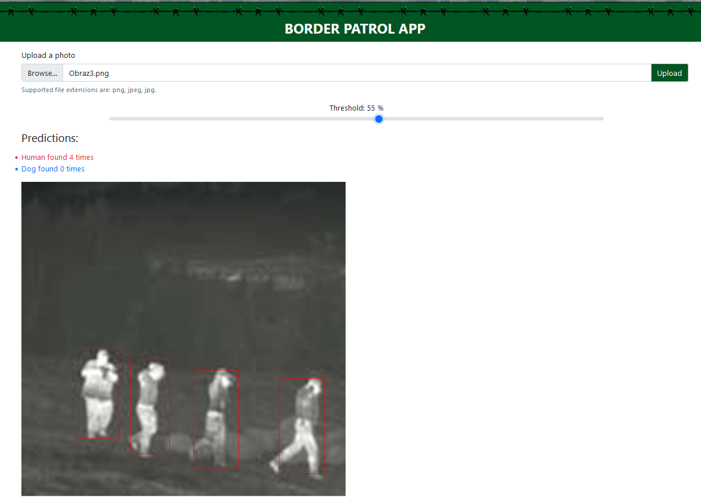
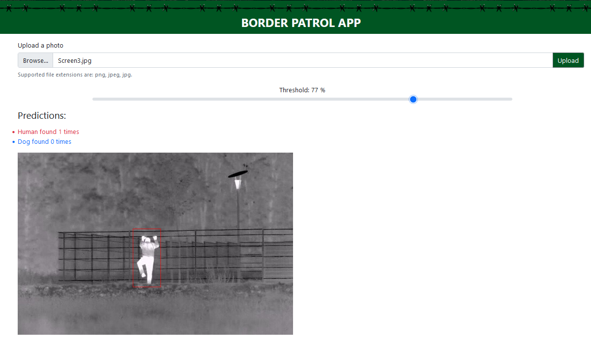

# Border patrol app

https://border-app.azurewebsites.net

## Table of Contents

- [General Information](#general-information)
- [Used Dataset](#used-dataset)
- [Used Technologies](#used-technologies)
- [Development process](#development-process)
- [Architecture Diagram](#architecture-diagram)
- [How does it work](#how-does-it-work)
- [Demo](#demo)
- [Screenshots](#screenshots)
- [Team](#team)

---

## General Information

Border patrol app is a web application which enables users to upload photos from cameras and then checks if there are people located on these photos. Users need to pass the authorization process and log in to the app to be able to use it. By doing this project we wanted to address a very recent problem of authorized crossing borders. It could be used as a system helping guards on borders to keep track of the eare around the border. It can be especially useful at night when there is a worse visibility for a human eye.

Tha app was created as a project no. 3 for a class "Introduction to applications and solutions based on Artificial Intelligence". The theme of a project was to create an app which brings some innovation to this world and has a potential of bringing benefits for people.

---

## Used Dataset

Ktoś coś o datasecie

---

## Used Technologies

- `Custom Vision Service`
- `Azure Storage`
- `Azure Web Services`
- `React.js 17.0.2`
- `Azure Logic App`

---

## Development process

- Finding a proper dataset of camera images made at night on the borders.
- Creation of detection system using one of Azure Cognitive Services - `Custom Vision`.
- Implementation of a frontend application using `React.js`.
- Connecting trained model with a frontend application using `REST API` and `Azure Storage`.
- Deployment of application using `Azure Web Services`.
- Connection of the app with `Azure Logic App`.

## Architecture Diagram

Diagram do zrobienia

---

## How does it work

1. A user opens the web application (hosted in `Azure App Service`) and is asked to log in to his Outlook account.
2. A user uploads a camera image and clicks the Upload button.
3. The web application sends the image to `Azure Blob Storage`.
4. `Azure Blob Storage` returns a url of the uploaded resource.
5. The web application sends the image url to `Custom Vision API`.
6. `Custom Vision API` returns predictions (detections) of people on the photo.
7. The web application shows a photo to a user with located people and probabilities.
8. User can adjust a threshold to make detections more or less accurate.

---

## Demo

See a demo (in polish):

Demo do zrobienia

---

## Screenshots

- Przykładowe działanie:

---

## Team

[Franciszek Wysocki](https://github.com/wysockif)

[Krzysztof Kowalski](https://github.com/KKofta)

[Patryk Peszko](https://github.com/Peszko-Patryk)

[Khameta Maksim](https://github.com/khametamaksim)

[Selivonets Aliaksei](https://github.com/alselivonets)

Kharashun Ilya

Podlesnyi Vladyslav
